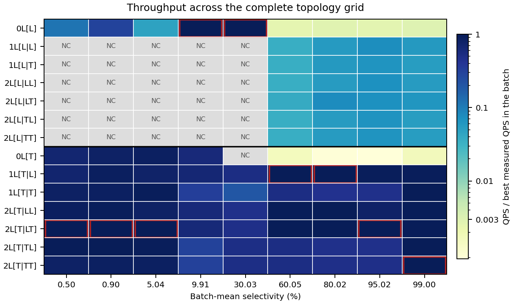

# ML-UNG：方法、固定配置表现与当前研究结论

这份材料用于约 10–15 分钟的导师汇报。完整推导与图示见[论文](main.pdf)，所有配置的原始汇总见[126 格数据](generated_data/factorial_equal_recall.csv)。

## 1. 要解决的问题

我们研究标签 AND 过滤的近似最近邻搜索。查询标签为 Q，向量标签为 A；只有 Q ⊆ A 的向量能进入结果。UNG 把标签集完全相同的向量放入同一 group，再按最小严格超集关系连接 groups，形成 LNG，并将这些关系落实为向量边。

问题有两部分：找到入口需要跨标签分支做最小超集筛选；进入向量图后，exact-group 边界又限制了几何导航。Amazon 的 602,453 个向量分成 482,387 个 groups，是这种细粒度组织的一个实例。

我们的核心设计是：**将 prefix frontier 入口与连接结构配套，再用共同前缀授权跨 group 的 block 内导航。** UNG 本身已使用 Trie 辅助找入口；区别在于我们改变 group 的连接关系和入口合同，并增加粗粒度的向量图。

## 2. 用同一个例子说明入口和 block

设 a < b < c，有三个 singleton groups：{b}、{b,c}、{a,b}。查询 Q={b} 时全部合法。

- LNG 从 {b} 可以分别走到另外两个组，所以最小入口只有 {b}。
- Prefix 连接只沿排序后的标签前缀。{b} 能走到 {b,c}，但 {a,b} 在另一分支，因此 prefix frontier 保留 {b} 和 {a,b} 两个入口。
- 阈值 T=1 时，{b} 与 {b,c} 聚成根为 {b} 的 block；两个点都包含 Q，block 内可以按向量邻近关系连边。{a,b} 仍由基层表示。

实际 prefix provider 用 label-to-group 压缩位图交集和 terminal 祖先检查计算 frontier。优化后的 LNG provider 用 cardinality buckets 和缓冲复用，但仍做集合包含筛选。Prefix 入口可能更多，省下的发现时间可能转化为更多 seed 和图搜索工作。

**入口交给 block 后，覆盖问题也会改变。** 若将唯一 LNG 入口 {b} 改标为 L1 且不保留其 L0 状态，搜索就到不了 residual group {a,b}，即使队列无限。Prefix frontier 则保留 {a,b} 的 L0 入口。论文新增三联图展示这一区别。

在完整保留 frontier 和所有授权 block 的入口、局部有向图能从入口到达全部 direct members、必要基层路径完整且穷尽搜索的条件下，prefix frontier 可以在这种转交后保留所有合法点的可达性。这是入口合同的性质：LNG 基层也能配合完整 prefix frontier。当前有界 ANN 的 Recall 仍由实测给出。

## 3. 0L、1L、2L 与实际查询

`mL` 表示 L0 之上的 m 个 overlay，物理层共 m+1 层。每一层的 `L/T` 分别表示 LNG/Trie 连接；L0 不被限定为 LNG。

| 配置 | L0 | L1 | L2 |
|---|---|---|---|
| `0L[L]`，本文的 Plain | LNG exact groups | 无 | 无 |
| `0L[T]` | Trie exact groups | 无 | 无 |
| `1L[T|L]` | Trie exact groups | LNG blocks | 无 |
| `2L[T|LT]` | Trie exact groups | LNG blocks | Trie blocks |

每个 overlay 独立从 canonical Trie 累计未覆盖点数；非根节点累计值严格超过 T 时发出 block。一个 block 的 direct members 排除同层已发出的后代 blocks。T 是发出阈值，不是最大点数。增大 T 不会增加 block 数，且 B(T) ≤ floor(N/(T+1))；不同尺度的成员分区仍可能交叉。

查询先用 Q ⊆ block 根标签进行整体授权，再创建入口状态。状态携带 `(vector_id, physical_level)`，始终只扩展本层边。授权 blocks 独立提供入口；group 入口可转交给拥有它的最细合法 overlay。所有层的状态竞争同一个有界队列。因此“本层边保持不变”不意味着加入高层后参与搜索的状态、覆盖或工作量不变。

## 4. 一个固定配置在各档表现如何

下表各列在九档中保持 topology 和阈值不变，阈值为 T1=1024、T2=16384；每档只按统一 Recall 规则选择搜索预算。它们来自 Amazon 开发集，未被包装成跨数据集验证的自动 selector。

所有性能列均为 **QPS，越大越好**。最后两列比较固定 `2L[T|LT]` 与 Plain、固定 `1L[T|L]`，不是逐档最优之间的比值。

| 平均选择率 | Plain `0L[L]` | `0L[T]` | `1L[T|L]` | `2L[T|LT]` | 2L/Plain | 2L/1L |
|---:|---:|---:|---:|---:|---:|---:|
| 0.499% | 2476.35 | 14921.90 | 15177.24 | 21707.89 | 8.766× | 1.430× |
| 0.903% | 4191.04 | 11591.42 | 12447.15 | 14278.50 | 3.407× | 1.147× |
| 5.038% | 544.93 | 10044.23 | 9105.22 | 11718.35 | 21.504× | 1.287× |
| 9.907% | 450.17 | 270.63 | 289.73 | 275.64 | 0.612× | 0.951× |
| 30.027% | 52.77 | NC | 27.66 | 25.42 | 0.482× | 0.919× |
| 60.047% | 4.07 | 2.51 | 1613.68 | 1598.42 | 392.812× | 0.991× |
| 80.024% | 1.80 | 0.59 | 648.35 | 646.83 | 358.773× | 0.998× |
| 95.020% | 1.50 | 0.49 | 520.35 | 564.63 | 375.746× | 1.085× |
| 99.001% | 0.79 | 0.44 | 253.23 | 257.77 | 327.562× | 1.018× |

固定两层组合在七档超过 Plain，在约 10% 和 30% 落后。对固定一层组合的优势也随批次变化。完整网格另外保留各深度的事后赢家：在 60%/80% 最优一层已经足够，95% 的最佳 QPS 从一层 520.35 提高到两层 564.63。固定 Trie 基层和 L1=LNG，只将 L2 从 LNG 改成 Trie，在 8/9 档更快，最大 1.251×；80% 为 0.998×，几乎持平。

图中每列相对该批次实测最大 QPS 归一化，红框为实测赢家，灰色为 NC。NC 指共享实测预算内没有达到 Recall 门槛。

**如何读这些批次：** Amazon 向量维度为 768，每批 1,000 queries，100 CPU query workers，1 cold + 2 warm。每次 warm 的**批次平均** Recall@10 都须 ≥0.90，取最小实测 Lsearch。5/30/60/80/95% 批次通过替换一部分谓词为高频 {1} 得到；99% 含 697 个空谓词和 303 个 {1}。这是混合批次的平均选择率，例如 5% 档单查询选择率从 0.0033% 到 96.702%，不是控制单一变量的选择率实验。

## 5. 加速来自哪里

入口变快并不保证总查询变快。下面的正反两档来自独立 instrumented profile，单位为多线程执行下的 **ms/query 阶段均值**。

| 平均选择率 | L0 系统与入口 | ELS 发现 | Seed 设置 | Graph 遍历 |
|---:|---|---:|---:|---:|
| 0.499% | LNG + optimized LNG | 20.352 | 0.195 | 2.076 |
| 0.499% | Trie + prefix frontier | 0.645 | 1.769 | 0.868 |
| 9.907% | LNG + optimized LNG | 36.631 | 0.646 | 98.747 |
| 9.907% | Trie + prefix frontier | 3.778 | 14.744 | 323.081 |

0.499% 时，发现与图搜索都变快，独立吞吐比为 6.03×；9.907% 时，入口发现仍变快，但 seed 和图搜索成本增加，吞吐比仅 0.60×。这里比较的是拓扑与各自入口的组合。

高平均选择率的大倍数还伴随很大的搜索预算差异：60%–99% 下，Plain 的 Lsearch 为 260,000–400,000，固定 `2L[T|LT]` 为 1,000–5,000。Lsearch 是候选容量，不是实际距离计算数；当前数组队列的扫描、插入和移动成本会随容量增加。因而这些吞吐比同时反映导航路径和达到质量门槛所需预算的变化。现有 profile 没有单独分离队列耗时，不能将大倍数全部归于几何导航。

QPS 用整个 batch 的 wall time 计算：B / batch seconds。上述阶段均值不能相加替代并发 batch latency。完整 counter 定义与所有 crossing 的 Lsearch/Recall 均在论文测量附录和 CSV 中。

## 6. 与已有工作的区别

| 相关方法 | 主要组织方式 | 本文的区别或所需对照 |
|---|---|---|
| UNG | exact-label groups + LNG containment cover + 最小入口 | 本文共同改变 prefix 连接、入口 frontier 与 block 粒度；Plain 使用优化后的 LNG 入口及共同执行后端 |
| ACORN | 全局图上的谓词无关扩展及过滤搜索 | 是必要的外部路线对照；目前完整网格仍是内部实现比较 |
| Curator | 共享聚类树与按查询组合的 qualified-subset indexes | 本文预先物化 prefix direct-member blocks，并用根标签授权导航 |
| FAVOR | 低选择率扫描，其余采用 exclusion-distance HNSW | 需要与其策略切换及高效 exact scan 在相同 AND 语义下比较 |
| LSSG，预印本 | 多层 label-similarity graphs | 多层标签图已有相关工作；本文需要突出 direct-member 聚合、prefix 授权和入口覆盖合同 |

至少 16 篇已发表 SIGMOD/PVLDB 相关工作及两个预印本见[文献备查](LITERATURE_NOTES_CN.md)与论文 references。当前证据建立了内部结构之间的性能交换，尚未建立相对外部强方法的整体竞争优势。

## 7. 自动参数与 GPU 构建：支持性研究

**DRH 无需 query 校准，但迁移表现不稳定。** R 为局部图度预算，C 为跨组度预算。DRH 用 T+N/T 的对称代理选 T1≈sqrt(N)，取最近二次幂；下一层阈值乘 rho=max(2,round(R/C))，N/T<C 时停止。N/T 是 block 数的宽松上界，T 不是局部搜索工作量上界，因此这不是最优延迟推导。

Amazon 的 N=602453、R=64、C=4 给出 1024:LNG、16384:Trie。DRH-v1 仅在存在合法物理层 h≥2 时进入多层后端；v2 再检查最高合法层的 direct mass。它们固定 LNG base，未选择完整系统的所有组件。

Genome/Reviews 的 DRH-v1 为 Plain 的 0.954–1.014×，VariousImg 仅 **0.205×**；后者的 v2 改到 **0.336×**。四个数据集都导出两个 overlays，未验证深度变化的有效性。五个人工候选使用同一 presence gate，单层候选因此始终执行 base；这组结果不能回答“自动方案是否优于充分调优的一层导航”。

**GPU 结果是构建后端的时间与资源测量。** Amazon 同一声明层级的 CPU builder 为 1000.64s，最快 hybrid 为 90.49s，即 11.06×。独立 base 与 hierarchy 阶段中位数之和为 141.27s，原 CPU base-only 为 190.38s；约 1.35× 是组合计时之比。最快输出索引的等 Recall 查询质量尚未验证。每个后端测量两次 warm，并另做资源 pass；查询本身在 CPU 上执行。

## 8. 下一步需要形成什么证据

| 需要回答的问题 | 当前缺少的证据 |
|---|---|
| 固定系统是否有竞争力 | 相同 AND、Recall、线程与调参口径下的外部强基线及高效 exact scan |
| 哪些数据形态适合 prefix/blocks | 核心组合跨数据集；标签顺序、query cardinality 与选择率分层的 Recall 分布 |
| 增层后为什么有 NC | 逐查询入口/owner/可达性诊断，以及保持覆盖的对照 |
| 大倍数值不值得额外空间 | 同质量下的队列成本、加载索引大小、每层邻接和并发 workspace |
| 自动选参与 GPU 是否能独立成立 | 有效的一层候选、会导出不同深度的数据形态、构建输出的质量对照 |
